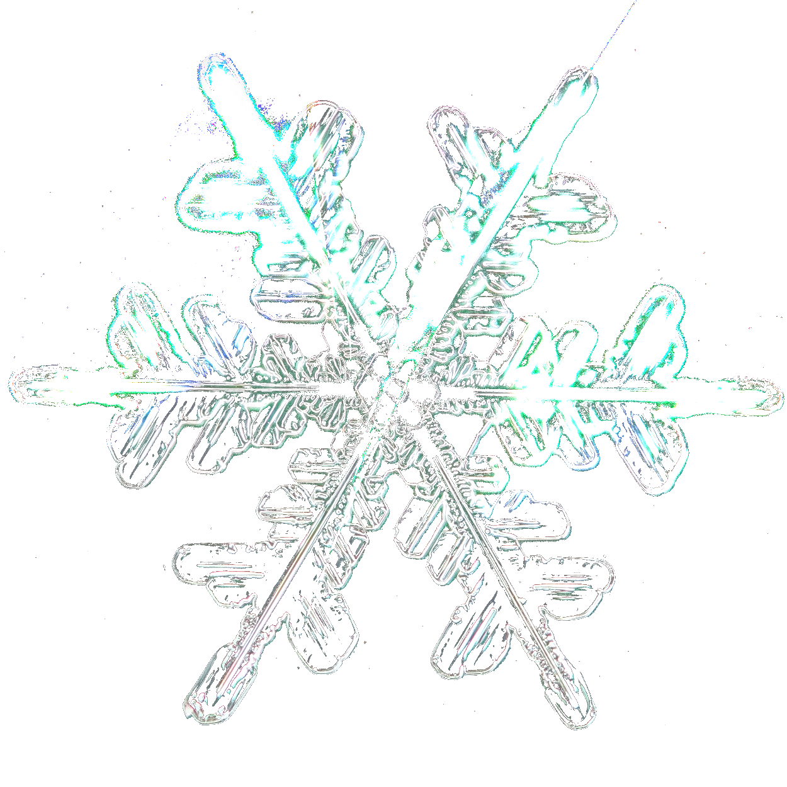

# RoFreeze

**RoFreeze** is a sleek, modern utility designed to automate the Roblox "freeze glitch". It features a polished acrylic user interface and easy-to-use hotkeys.



## Features

- **Freeze Glitch Automation**: Automatically saves cursor position and spams spacebar to freeze the client.
- **Modern UI**: Clean, dark-themed interface with Windows 10/11 acrylic (blur) effect.
- **Hotkeys**:
  - `Q`: Set the freeze point (cursor position).
  - `F3`: Toggle the freeze on/off.
- **Status Feedback**: Visual indicators for tool status (Ready, Running, Frozen).

## Installation

### Option 1: Download Executable (Recommended)
1. Go to the [Releases](https://github.com/Plexity3D/RobloxFreezeGlitchScript/releases) page.
2. Download the latest `RoFreeze.exe`.
3. Run the executable.

### Option 2: Run from Source
If you prefer to run the Python script directly:

1. **Prerequisites**: Python 3.8+ installed.
2. **Clone the repository**:
   ```bash
   git clone https://github.com/Plexity3D/RobloxFreezeGlitchScript.git
   cd RobloxFreezeGlitchScript
   ```
3. **Install dependencies**:
   ```bash
   pip install -r requirements.txt
   ```
4. **Run**:
   ```bash
   python main.py
   ```

## Usage Guide

1. **Launch RoFreeze**.
2. Click the **"Get Started"** button in the app window. The status should change to "Running...".
3. Switch to your Roblox game window.
4. **Set Position**: Move your mouse to the white bar at the top of the Roblox player window and press **`Q`**.
   - *Tip*: This saves the coordinate where the mouse will lock.
5. **Freeze**: Press **`F3`** to activate the glitch.
   - Your mouse will lock to the saved position.
   - The spacebar will be pressed repeatedly.
6. **Unfreeze**: Press **`F3`** again to toggle it off.
7. To stop the tool completely, click "Stop" in the app or close the window.

> **Note**: This glitch may behave differently depending on the Roblox camera mode (e.g., it often breaks in first-person/shiftlock modes).

## Troubleshooting

- **Admin Privileges**: If hotkeys (`Q` / `F3`) are not detected while Roblox is focused, try running `RoFreeze.exe` (or your terminal) as **Administrator**.
- **Acrylic Effect Missing**: The blurred background effect requires Windows 10 or 11. On older versions or other OSs, the background may appear solid or transparent.
- **Antivirus**: Some antivirus software may flag the executable because it automates keyboard/mouse inputs. This is a false positive common with macro software. You may need to add an exclusion.

## Building

For instructions on how to build the `.exe` yourself using PyInstaller, see [BUILD_INSTRUCTIONS.md](BUILD_INSTRUCTIONS.md).

## Disclaimer
This tool is for educational purposes. Use it responsibly. The authors are not responsible for any consequences resulting from the use of this software.
